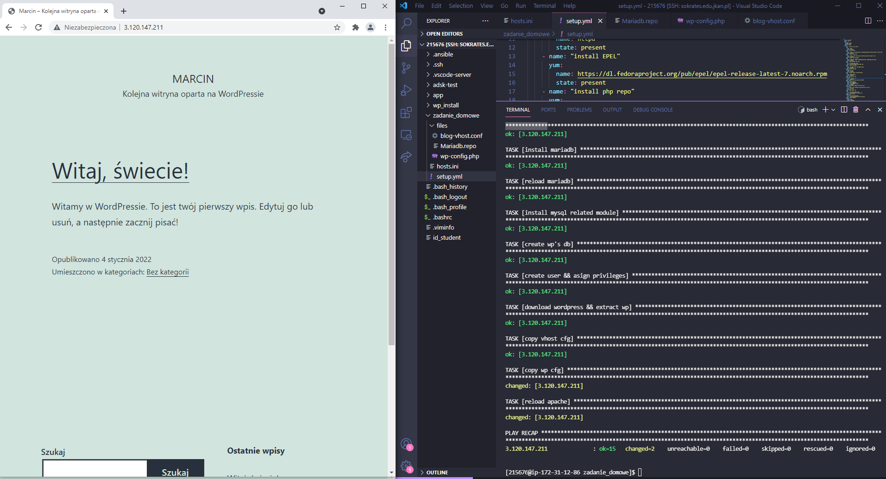

# Zadanie 1
## Kroki instalacji

1. Stworzenie maszyny wirtualnej na AWS
2. Połączenie na sokrates.edu.jkan.pl
3. Stworzenie pliku hosts.ini z zadeklarowaniem w wp_nodes ip wcześniej stworzonej maszyny
4. Stworzenie folderu *files* zawierającego potrzebne pliki konfiguracyjne (*Mariadb.repo, wp-config.php, blog-vhost.conf*)
5. Stworzenie pliku *setup.yml* 
```
Plik setup.yml zawiera:
- zadeklarowanie hostów
- instalację EPEL
- instalację repozytorium php (remi)
- instalację bibliotek php (php80-php, php80, php80-php-mysqlnd, php80-php-pecl-mysql)
- skopiowanie configu Mariadb z pliku files/Mariadb.repo
- instalację Mariadb
- instalację MySQL
- instalację MySQL-python
- stworzenie bazy danych pod aplikację WordPress
- zadeklarowanie permisji dostępów użytkowników WordPress
- instalację WordPress
- zaciągnięcie configu vhostów z pliku files/blog-vhost.conf
- zaciągnięcie configu WordPress z pliku files/wp-config.php
```

## Egzekucja setup.yml oraz rezultat
```
ansible-playbook setup.yml -i hosts.ini
```
